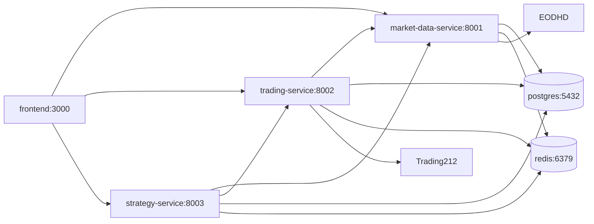

# Architecture (Phase 0 Scaffold)

```mermaid
flowchart LR
  FE[frontend:3000] --> MDS[market-data-service:8001]
  FE --> TS[trading-service:8002]
  FE --> SS[strategy-service:8003]
  TS --> MDS
  SS --> MDS
  SS --> TS
  MDS --> PG[(postgres:5432)]
  TS --> PG
  SS --> PG
  MDS --> RD[(redis:6379)]
  TS --> RD
  SS --> RD
  MDS --> EODHD[EODHD]
  TS --> T212[Trading212]
```
