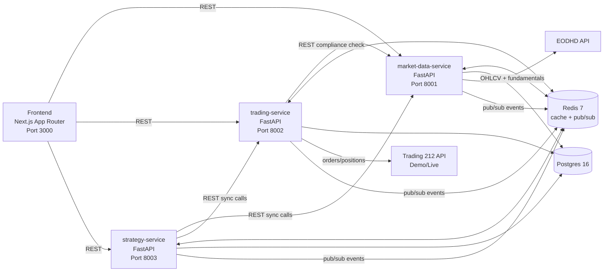

# Shariah-Compliant Trading Bot — Planning Document (Pre-Implementation)

## 0) Scope & Delivery Contract

This document is the **pre-coding plan** you requested. It covers architecture, contracts, schema DDL, sequencing, testing, and risks.

I will **not scaffold or write implementation code** until you confirm this plan.

---

## 1) Confirmed Architecture Diagram



### Service ownership boundaries
- **market-data-service** owns instrument master, OHLCV/fundamentals, compliance reports, taxonomy.
- **trading-service** owns orders, order events, executions, positions, account snapshots.
- **strategy-service** owns regimes, strategies, signals, backtest runs/trades.
- Cross-service data access is via REST + Redis events, **never direct table reads across service boundaries**.

---

## 2) Final DB Schema (DDL) + proposed changes

### What I’m changing from your draft (and why)
1. Add `service` + `correlation_id` columns to `audit_log` for deterministic correlation with structured logs.
2. Add `provider_version` and `ruleset_version` to `shariah_compliance_reports` to make verdict reproducibility explicit over time.
3. Add append-only enforcement triggers for audit-critical tables.
4. Add `CHECK` constraints for non-negative numeric fields where applicable.
5. Add `config_hash` to `config_history` so we can cheaply detect no-op reloads.

### Canonical enums (Postgres)
- `instrument_type_enum`: `EQUITY`, `ETF`
- `compliance_status_enum`: `COMPLIANT`, `QUESTIONABLE`, `NON_COMPLIANT`, `UNKNOWN`
- `screen_result_enum`: `PASS`, `FAIL`, `UNKNOWN`
- `regime_enum`: `BEAR`, `CRASH`, `EUPHORIA`, `BULL`
- `order_side_enum`: `BUY`, `SELL`
- `order_type_enum`: `MARKET`, `LIMIT`, `STOP`, `STOP_LIMIT`
- `order_status_enum`: `PENDING_SUBMIT`, `SUBMITTED`, `PARTIALLY_FILLED`, `FILLED`, `CANCELLED`, `REJECTED`, `FAILED`

### DDL (condensed but executable shape)

```sql
-- extensions
CREATE EXTENSION IF NOT EXISTS pgcrypto;

-- shared audit columns convention: id UUID PK default gen_random_uuid(), created_at timestamptz default now(), updated_at timestamptz default now(), deleted_at timestamptz null

CREATE TABLE instruments (
  id UUID PRIMARY KEY DEFAULT gen_random_uuid(),
  symbol TEXT NOT NULL,
  isin TEXT UNIQUE,
  name TEXT NOT NULL,
  currency TEXT NOT NULL,
  exchange TEXT NOT NULL,
  instrument_type instrument_type_enum NOT NULL,
  is_active BOOLEAN NOT NULL DEFAULT true,
  metadata JSONB NOT NULL DEFAULT '{}'::jsonb,
  created_at TIMESTAMPTZ NOT NULL DEFAULT now(),
  updated_at TIMESTAMPTZ NOT NULL DEFAULT now(),
  deleted_at TIMESTAMPTZ NULL,
  UNIQUE(symbol, exchange)
);

CREATE TABLE broker_symbols (
  id UUID PRIMARY KEY DEFAULT gen_random_uuid(),
  instrument_id UUID NOT NULL REFERENCES instruments(id) ON DELETE RESTRICT,
  broker TEXT NOT NULL,
  broker_ticker TEXT NOT NULL,
  tradable BOOLEAN NOT NULL DEFAULT false,
  min_quantity NUMERIC(20,8),
  tick_size NUMERIC(20,8),
  last_synced_at TIMESTAMPTZ,
  created_at TIMESTAMPTZ NOT NULL DEFAULT now(),
  updated_at TIMESTAMPTZ NOT NULL DEFAULT now(),
  deleted_at TIMESTAMPTZ NULL,
  UNIQUE(broker, broker_ticker),
  UNIQUE(instrument_id, broker)
);

CREATE TABLE shariah_compliance_reports (
  id UUID PRIMARY KEY DEFAULT gen_random_uuid(),
  instrument_id UUID NOT NULL REFERENCES instruments(id) ON DELETE RESTRICT,
  provider TEXT NOT NULL,
  provider_version TEXT,
  ruleset_version TEXT,
  methodology TEXT NOT NULL,
  status compliance_status_enum NOT NULL,
  business_screen screen_result_enum NOT NULL,
  financial_screen screen_result_enum NOT NULL,
  compliant_revenue_pct NUMERIC(20,8),
  non_compliant_revenue_pct NUMERIC(20,8),
  questionable_revenue_pct NUMERIC(20,8),
  debt_to_market_cap_ratio NUMERIC(20,8),
  securities_to_market_cap_ratio NUMERIC(20,8),
  interest_income_to_revenue_ratio NUMERIC(20,8),
  report_date DATE NOT NULL,
  fetched_at TIMESTAMPTZ NOT NULL,
  screen_inputs JSONB NOT NULL,
  rationale TEXT NOT NULL,
  raw_response JSONB,
  created_at TIMESTAMPTZ NOT NULL DEFAULT now(),
  updated_at TIMESTAMPTZ NOT NULL DEFAULT now(),
  deleted_at TIMESTAMPTZ NULL
);
CREATE INDEX idx_compliance_latest ON shariah_compliance_reports (instrument_id, provider, fetched_at DESC);

CREATE TABLE market_data_ohlcv (
  instrument_id UUID NOT NULL REFERENCES instruments(id) ON DELETE RESTRICT,
  bar_date DATE NOT NULL,
  open NUMERIC(20,8) NOT NULL,
  high NUMERIC(20,8) NOT NULL,
  low NUMERIC(20,8) NOT NULL,
  close NUMERIC(20,8) NOT NULL,
  adjusted_close NUMERIC(20,8),
  volume NUMERIC(20,8) NOT NULL,
  source TEXT NOT NULL,
  created_at TIMESTAMPTZ NOT NULL DEFAULT now(),
  updated_at TIMESTAMPTZ NOT NULL DEFAULT now(),
  deleted_at TIMESTAMPTZ NULL,
  PRIMARY KEY (instrument_id, bar_date, source)
);

CREATE TABLE market_regimes (
  id UUID PRIMARY KEY DEFAULT gen_random_uuid(),
  regime regime_enum NOT NULL,
  confidence NUMERIC(20,8) NOT NULL,
  detected_at TIMESTAMPTZ NOT NULL,
  inputs_snapshot JSONB NOT NULL,
  model_version TEXT NOT NULL,
  created_at TIMESTAMPTZ NOT NULL DEFAULT now(),
  updated_at TIMESTAMPTZ NOT NULL DEFAULT now(),
  deleted_at TIMESTAMPTZ NULL
);

CREATE TABLE signals (
  id UUID PRIMARY KEY DEFAULT gen_random_uuid(),
  strategy_id UUID,
  instrument_id UUID NOT NULL REFERENCES instruments(id) ON DELETE RESTRICT,
  regime_id UUID REFERENCES market_regimes(id) ON DELETE RESTRICT,
  direction order_side_enum NOT NULL,
  strength NUMERIC(20,8) NOT NULL,
  target_quantity NUMERIC(20,8),
  rationale JSONB NOT NULL,
  generated_at TIMESTAMPTZ NOT NULL,
  acted_upon BOOLEAN NOT NULL DEFAULT false,
  rejection_reason TEXT,
  created_at TIMESTAMPTZ NOT NULL DEFAULT now(),
  updated_at TIMESTAMPTZ NOT NULL DEFAULT now(),
  deleted_at TIMESTAMPTZ NULL
);

CREATE TABLE orders (
  id UUID PRIMARY KEY DEFAULT gen_random_uuid(),
  idempotency_key TEXT NOT NULL UNIQUE,
  signal_id UUID REFERENCES signals(id) ON DELETE RESTRICT,
  instrument_id UUID NOT NULL REFERENCES instruments(id) ON DELETE RESTRICT,
  broker TEXT NOT NULL,
  broker_order_id TEXT,
  side order_side_enum NOT NULL,
  order_type order_type_enum NOT NULL,
  quantity NUMERIC(20,8) NOT NULL,
  limit_price NUMERIC(20,8),
  stop_price NUMERIC(20,8),
  time_in_force TEXT NOT NULL,
  status order_status_enum NOT NULL,
  submitted_at TIMESTAMPTZ,
  filled_at TIMESTAMPTZ,
  filled_quantity NUMERIC(20,8) NOT NULL DEFAULT 0,
  filled_value NUMERIC(20,8) NOT NULL DEFAULT 0,
  account_type TEXT NOT NULL,
  environment TEXT NOT NULL,
  error_payload JSONB,
  created_at TIMESTAMPTZ NOT NULL DEFAULT now(),
  updated_at TIMESTAMPTZ NOT NULL DEFAULT now(),
  deleted_at TIMESTAMPTZ NULL
);
CREATE INDEX idx_orders_working ON orders(status) WHERE status IN ('PENDING_SUBMIT','SUBMITTED','PARTIALLY_FILLED');
CREATE INDEX idx_orders_broker_order_id ON orders(broker, broker_order_id);

CREATE TABLE order_events (
  id UUID PRIMARY KEY DEFAULT gen_random_uuid(),
  order_id UUID NOT NULL REFERENCES orders(id) ON DELETE RESTRICT,
  event_type TEXT NOT NULL,
  payload JSONB NOT NULL,
  occurred_at TIMESTAMPTZ NOT NULL,
  created_at TIMESTAMPTZ NOT NULL DEFAULT now(),
  updated_at TIMESTAMPTZ NOT NULL DEFAULT now(),
  deleted_at TIMESTAMPTZ NULL
);

CREATE TABLE audit_log (
  id UUID PRIMARY KEY DEFAULT gen_random_uuid(),
  actor TEXT NOT NULL,
  service TEXT NOT NULL,
  action TEXT NOT NULL,
  entity_type TEXT NOT NULL,
  entity_id UUID,
  correlation_id TEXT NOT NULL,
  payload JSONB NOT NULL,
  occurred_at TIMESTAMPTZ NOT NULL,
  created_at TIMESTAMPTZ NOT NULL DEFAULT now(),
  updated_at TIMESTAMPTZ NOT NULL DEFAULT now(),
  deleted_at TIMESTAMPTZ NULL
);
CREATE INDEX idx_audit_corr ON audit_log(correlation_id, occurred_at DESC);
```

> Note: Full Phase 1 migration set will include all tables from your draft plus this baseline; above is condensed in this plan for readability.

---

## 3) OpenAPI Contract Sketches

## market-data-service (8001)
- `GET /health`
- `GET /instruments?compliant_only=bool&provider=str`
  - `200`: `InstrumentListResponse`
- `GET /instruments/{instrument_id}/ohlcv?from=YYYY-MM-DD&to=YYYY-MM-DD&interval=1d`
  - `200`: `OHLCVResponse`
- `GET /instruments/{instrument_id}/compliance?provider=str`
  - `200`: `ComplianceReportDTO`
- `POST /instruments/{instrument_id}/compliance/recompute`
  - `202`: `JobAcceptedResponse`
- `POST /instruments/{instrument_id}/refresh`
  - `202`: `JobAcceptedResponse`
- `GET /universe`
  - `200`: `UniverseResponse`
- `POST /jobs/sync-universe`
  - `202`
- `POST /jobs/recompute-compliance`
  - `202`
- `GET /taxonomy`
- `PUT /taxonomy/{id}`

## trading-service (8002)
- `GET /health`
- `GET /account/summary`
- `GET /positions`
- `POST /orders`
  - request: `CreateOrderFromSignalRequest`
  - response: `OrderAcceptedResponse`
- `GET /orders/{id}`
- `GET /orders?status=`
- `DELETE /orders/{id}`
- `POST /reconcile`
- `GET /broker/info`

## strategy-service (8003)
- `GET /health`
- `GET /regime/current`
- `POST /regime/recompute`
- `GET /strategies`
- `GET /strategies/{id}`
- `POST /signals/generate`
- `POST /backtest`
- `GET /backtest/{id}`

---

## 4) Fully-fleshed interface signatures (Python)

```python
from __future__ import annotations
from datetime import date, datetime
from decimal import Decimal
from enum import StrEnum
from typing import Any, Literal, Protocol
from pydantic import BaseModel, Field

class Regime(StrEnum):
    BEAR = "BEAR"
    CRASH = "CRASH"
    EUPHORIA = "EUPHORIA"
    BULL = "BULL"

class OrderSide(StrEnum):
    BUY = "BUY"
    SELL = "SELL"

class OrderType(StrEnum):
    MARKET = "MARKET"
    LIMIT = "LIMIT"
    STOP = "STOP"
    STOP_LIMIT = "STOP_LIMIT"

class OrderStatus(StrEnum):
    PENDING_SUBMIT = "PENDING_SUBMIT"
    SUBMITTED = "SUBMITTED"
    PARTIALLY_FILLED = "PARTIALLY_FILLED"
    FILLED = "FILLED"
    CANCELLED = "CANCELLED"
    REJECTED = "REJECTED"
    FAILED = "FAILED"

class ComplianceStatus(StrEnum):
    COMPLIANT = "COMPLIANT"
    QUESTIONABLE = "QUESTIONABLE"
    NON_COMPLIANT = "NON_COMPLIANT"
    UNKNOWN = "UNKNOWN"

class BrokerCapabilities(BaseModel):
    supports_market_orders: bool
    supports_limit_orders: bool
    supports_stop_orders: bool
    supports_stop_limit_orders: bool
    supports_extended_hours: bool
    supports_fractional_shares: bool
    supports_short_selling: bool
    supports_options: bool
    min_order_value: Decimal | None
    base_currency: str
    rate_limit_per_minute: int
    is_paper: bool

class AccountSummary(BaseModel):
    broker: str
    account_id: str
    account_type: Literal["ISA", "INVEST", "DEMO", "PAPER", "OTHER"]
    currency: str
    cash_available: Decimal
    cash_reserved: Decimal
    investments_value: Decimal
    total_value: Decimal
    realized_pnl: Decimal
    unrealized_pnl: Decimal
    fetched_at: datetime

class BrokerPosition(BaseModel):
    broker_symbol: str
    quantity: Decimal
    average_price: Decimal
    current_price: Decimal | None
    market_value: Decimal
    unrealized_pnl: Decimal
    currency: str

class OrderRequest(BaseModel):
    idempotency_key: str
    broker_symbol: str
    side: OrderSide
    order_type: OrderType
    quantity: Decimal = Field(gt=Decimal("0"))
    limit_price: Decimal | None = None
    stop_price: Decimal | None = None
    time_in_force: Literal["DAY", "GTC"] = "DAY"
    extended_hours: bool = False

class BrokerOrder(BaseModel):
    broker: str
    broker_order_id: str | None
    idempotency_key: str
    status: OrderStatus
    submitted_at: datetime | None
    filled_at: datetime | None
    filled_quantity: Decimal
    filled_value: Decimal
    avg_fill_price: Decimal | None
    raw_response: dict[str, Any]

class BrokerProvider(Protocol):
    name: str
    capabilities: BrokerCapabilities
    async def health_check(self) -> bool: ...
    async def resolve_symbol(self, internal_symbol: str) -> str: ...
    async def get_account_summary(self) -> AccountSummary: ...
    async def get_positions(self) -> list[BrokerPosition]: ...
    async def place_order(self, req: OrderRequest) -> BrokerOrder: ...
    async def get_order(self, broker_order_id: str) -> BrokerOrder: ...
    async def cancel_order(self, broker_order_id: str) -> BrokerOrder: ...
    async def list_open_orders(self) -> list[BrokerOrder]: ...
    async def get_order_history(self, since: datetime) -> list[BrokerOrder]: ...

class ComplianceReport(BaseModel):
    instrument_symbol: str
    provider: str
    methodology: Literal["AAOIFI", "DJIM", "OTHER"]
    status: ComplianceStatus
    business_screen: Literal["PASS", "FAIL", "UNKNOWN"]
    financial_screen: Literal["PASS", "FAIL", "UNKNOWN"]
    compliant_revenue_pct: Decimal | None
    non_compliant_revenue_pct: Decimal | None
    questionable_revenue_pct: Decimal | None
    debt_to_market_cap_ratio: Decimal | None
    securities_to_market_cap_ratio: Decimal | None
    interest_income_to_revenue_ratio: Decimal | None
    report_date: date
    fetched_at: datetime
    screen_inputs: dict[str, Any]
    rationale: str

class ComplianceProvider(Protocol):
    name: str
    methodology: str
    async def get_report(self, symbol: str) -> ComplianceReport: ...
    async def bulk_get_reports(self, symbols: list[str]) -> list[ComplianceReport]: ...

class Signal(BaseModel):
    id: str
    symbol: str
    side: OrderSide
    strength: Decimal
    target_quantity: Decimal | None
    rationale: dict[str, Any]

class StrategyContext(BaseModel):
    as_of: datetime
    regime: Regime
    universe_symbols: list[str]
    positions: dict[str, Decimal]
    cash_available: Decimal
    ohlcv: dict[str, list[dict[str, Any]]]
    fundamentals: dict[str, dict[str, Any]]
    parameters: dict[str, Any]

class Strategy(Protocol):
    name: str
    version: str
    applicable_regimes: list[Regime]
    async def generate_signals(self, ctx: StrategyContext) -> list[Signal]: ...
```

---

## 5) Open questions requiring your decisions

1. **Benchmark for regime detection**: FTSE 100, S&P 500, MSCI World, or blended benchmark?
2. **Fractional share policy** in ISA: allow all fractional buys/sells where broker permits, or enforce minimum lot/rounding rules globally?
3. **Minimum trade notional** (GBP) and minimum position size?
4. **FX treatment** for non-GBP instruments in GBP ISA: accept T212 conversion implicitly, or add explicit FX spread guardrails?
5. **Intraday data scope** in v1: daily bars only, or include intraday endpoint/storage now?
6. **Cross-check provider** timeline: keep `null` in Phase 1–3, or stub active comparison paths immediately?
7. **Daily loss limit behavior**: auto-disable until manual UI toggle only, or allow scheduled auto-reenable next day?
8. **Backtest benchmark & risk-free rate** for Sharpe/Sortino calculations?
9. **Order sizing convention**: quantity-based only, or support target-notional order intents converted by broker adapter?
10. **Phase branch strategy**: one branch per phase (`phase/0-scaffold` etc.) as requested, confirm naming.

---

## 6) Risks & Mitigations

- **T212 API instability / beta behavior**: mitigate with circuit breaker, retries, idempotency table-first workflow, reconcile job.
- **Idempotency race conditions**: enforce DB unique key + transaction boundary before outbound call.
- **Rate limits**: token bucket keyed by API credential; queue/reject with explicit reason logs.
- **AAOIFI in-house misclassification**: deterministic taxonomy + golden cases + optional cross-check provider downgrade.
- **Regime overfitting**: keep v1 rules simple, versioned, auditable inputs snapshot, out-of-sample backtests.
- **Look-ahead bias**: strict as-of data loader in backtest adapter + explicit tests.
- **Decimal precision drift**: Decimal-only domain + quantization at boundaries, no float persistence.
- **Timezone issues (BST/GMT)**: internal UTC everywhere, timezone conversion at UI only.
- **EODHD data gaps**: UNKNOWN status default block; monitoring for coverage ratio.
- **Operational blind spots**: structured typed logs + mandatory correlation IDs + dual audit logging.

---

## 7) Makefile target list (planned)

- `make up` — start local stack (dev profile)
- `make down` — stop stack
- `make logs` — tail compose logs
- `make test` — backend+frontend tests
- `make test-be` — backend tests only
- `make test-fe` — frontend tests only
- `make lint` — ruff + eslint + prettier check
- `make typecheck` — mypy strict + tsc --noEmit
- `make migrate` — run alembic migrations for all services
- `make seed` — seed taxonomy + baseline data
- `make backtest` — run backtest CLI wrapper
- `make clean` — remove caches/pyc/node artifacts
- `make coverage` — generate coverage reports and enforce thresholds

---

## 8) Phase execution sequence and checkpoints

- **Phase 0**: scaffold only + health endpoints + compose + docs.
- **Stop for your review.**
- **Phase 1**: logging infra first, then DB + config loader.
- **Stop for your review.**
- Continue phase-by-phase exactly as specified.

---

## 9) Explicit safety assertions to enforce from day one

1. Default runtime = `demo`, never live.
2. Live requires both `LIVE_TRADING=true` and CLI confirmation flag.
3. `BOT_ENABLED=false` blocks order placement at pre-submit guard.
4. No BUY order without fresh `COMPLIANT` report.
5. Unknown compliance blocks by default.
6. Trading service depends only on Broker/Compliance protocols, not concrete vendor classes.

---

## Confirmation Request

If this plan looks good, reply with **"Approved — proceed to Phase 0"** (or list required changes), and I will scaffold Phase 0 and stop for review.
